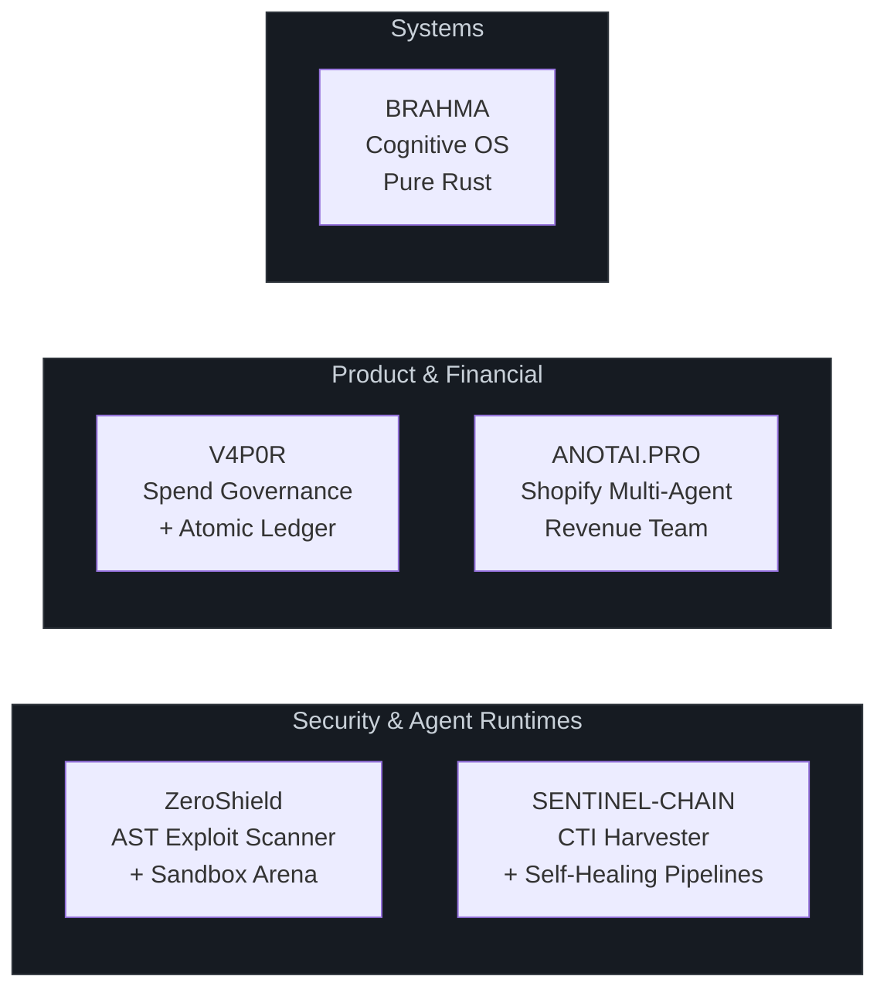

<div align="center">

  

  <br/>

  ## Priyanshu

  <a href="https://git.io/typing-svg">
    
  </a>

  <br/>

  <sub>
    <a href="https://www.linkedin.com/in/priyanshu-s4nvi/">LinkedIn</a> · 
    <a href="https://x.com/w3fparthh">X</a> · 
    <a href="mailto:priyanshupk2022@gmail.com">priyanshupk2022@gmail.com</a> · 
    Discord: <code>w3f.parthh</code>
  </sub>

</div>

<br/>

I build AI-powered products, autonomous agent systems, and production backend infrastructure. Most of my work involves taking an idea through architecture, implementation, testing, and deployment — then iterating on it.

My projects span AST-level code analysis and exploit sandboxing, self-healing data pipelines with mathematical drift detection, deterministic financial engines with atomic concurrency control, multi-agent SaaS applications, and systems-level programming in Rust.

I use AI tools heavily in my development workflow, but the engineering decisions, system architecture, invariant enforcement, and testing are mine.

---

### Systems I've Built



---

### Flagship Projects

<br/>

<table>
<tr><td>

#### [`ZeroShield`](https://github.com/priyanshupk2022-arch/zeroshield)
**Autonomous vulnerability scanner, exploit sandbox, and AST codemod synthesizer**

Scans JavaScript/TypeScript ASTs using the TypeScript Compiler API (`ts.createSourceFile`) to detect tainted source-to-sink injection paths — CWE-78, CWE-1321, CWE-287. Provisions ephemeral Docker containers via Daytona SDK to execute real attack payloads in isolation, then synthesizes safe AST rewrites validated by Zod schemas.

Every fix goes through Triple-Lock verification: the exploit payload must be blocked, golden inputs must return HTTP 200, and the full test suite must pass with exit code 0. Deploys a JSON-RPC 2.0 Model Context Protocol (MCP) server with SQLite WAL session persistence. HMAC SHA-256 human-in-the-loop gate before any PR dispatch.

`TypeScript 5.7` · `Node.js 22` · `React 19` · `Daytona SDK` · `MCP` · `Express` · `SQLite WAL`

**27/27 passing tests** — `node --test packages/core/dist/**/*.test.js`

</td></tr>
</table>

<br/>

<table>
<tr><td>

#### [`V4P0R`](https://github.com/priyanshupk2022-arch/V4P0R)
**Two-speed corporate card and spend governance engine**

Designed around the problem of concurrent AI agents spending against shared budgets. Speed 1: sub-100ms authorization decisions executed atomically inside a single Redis Lua script (`process_authorization.lua`) — no race conditions, no double-spending. Speed 2: asynchronous settlement into an append-only PostgreSQL double-entry ledger with database-enforced `DEBIT == CREDIT` balance constraints and Row-Level Security.

All financial arithmetic uses strict `BigInt` integer minor units (`centsMath.ts`) — zero IEEE 754 floating-point precision errors. Webhook replay protection via constant-time HMAC-SHA256 validation with 300-second timestamp drift tolerance.

Clean architecture: `domain/` · `application/` · `infrastructure/` · `adapters/`

`TypeScript` · `Next.js 15` · `Upstash Redis (Lua)` · `Supabase PostgreSQL RLS` · `Vitest` · `Zod`

**66/66 passing tests** — unit (centsMath, HMAC, policy evaluator, state machine) + integration (Prava adapter, backend sealed, sandbox pilot)

</td></tr>
</table>

<br/>

<table>
<tr><td>

#### [`SENTINEL-CHAIN`](https://github.com/priyanshupk2022-arch/SENTINEL-CHAIN)
**Autonomous Cyber Threat Intelligence harvester with self-healing scraper substrate**

Continuously ingests CVE records and security advisories from web intelligence sources. When a target portal changes its DOM structure, the system detects the breakage through a mathematical drift model:

> Quality: `Qs = 0.50·Cf + 0.30·Vt + 0.20·Ac` — Drift: `Dt = 1.0 - Qs`
>
> Feeds are quarantined when `Dt > 0.35` to protect the downstream Threat Knowledge Graph.

Broken scrapers are repaired automatically via Bright Data AI Flow — DOM deltas dispatched to `/refactor_template`, updated CSS selectors verified against clean data, and collection resumed without manual intervention. Tests run against an in-process mock target server simulating V1→V2 DOM transitions.

`Python 3.11` · `FastAPI` · `Next.js 14` · `SQLAlchemy 2.0 Async` · `Bright Data API` · `Docker Compose`

**13/13 passing tests** — `pytest backend/tests/ -v`

</td></tr>
</table>

<br/>

<table>
<tr><td>

#### [`BRAHMA`](https://github.com/priyanshupk2022-arch/BRAHMA)
**Cognitive operating system and MCTS AST solver in pure Rust**

An autonomous programming runtime that uses Monte Carlo Tree Search to explore candidate AST mutations, pruning type-invalid branches before compilation. Built on a Salsa-like incremental query database that tests mutations and automatically rolls back type mismatches.

Strict memory safety: `#![forbid(unsafe_code)]`. Cryptographic memory enclave with Argon2 password hashing, AES-GCM encryption, and memory scrubbing via `zeroize`. Interactive terminal UI built with Ratatui.

30+ modules: `mcts.rs` · `mutator.rs` · `parser.rs` · `crypto.rs` · `security.rs` · `sandbox.rs` · `orchestration.rs` · `tui.rs`

`Rust 2024 Edition` · `Tokio` · `Syn` · `Quote` · `Rusqlite WAL` · `Ratatui`

</td></tr>
</table>

<br/>

<table>
<tr><td>

#### [`ANOTAI.PRO`](https://github.com/priyanshupk2022-arch/ANOTAI.PRO)
**Shopify-embedded multi-agent revenue and margin operations team**

A Remix SaaS application embedded in the Shopify Admin that coordinates five autonomous agents: Personal Shopper, Cart Sniper, Retention Engine, Margin Guardian, and CEO escalation. The Margin Guardian enforces a hard financial guardrail — computes COGS in real time and vetoes or escalates unprofitable discount recommendations before they reach the Shopify API.

Durable action queue decouples agent recommendations from execution, with configurable merchant risk tolerances (`suggest_only` / `draft_action` / `auto_execute`). Token consumption and API costs tracked per workflow.

`TypeScript` · `Remix Vite` · `Shopify Polaris` · `App Bridge` · `Prisma ORM` · `Supabase` · `Gemini 1.5 Pro`

</td></tr>
</table>

---

### Stack

```
Languages          TypeScript · Python · Rust · JavaScript · SQL · Bash
Product            React 19 · Next.js 15 · Remix · Shopify Polaris · Tailwind CSS
Backend            Node.js 22 · FastAPI · Tokio · Express
Data               PostgreSQL (Supabase RLS) · Redis (Lua scripting) · SQLite (WAL) · Prisma
AI & Agents        Model Context Protocol (MCP) · AST codemods · Multi-agent orchestration · Gemini
Infrastructure     Docker · Daytona SDK · GitHub Actions · Docker Compose
Security           HMAC-SHA256 · Zod validation · Argon2 · AES-GCM · #![forbid(unsafe_code)]
Testing            Vitest · Pytest · Node Test Runner · Cargo Test
```

---

### How I Work

**Deterministic invariants over probabilistic outputs.** Business logic, financial arithmetic, and security perimeters are enforced by deterministic code — Zod schemas, BigInt cents math, Redis Lua atomics, database constraints. AI generates drafts; invariants enforce correctness.

**Triple-Lock verification before shipping.** A system isn't fixed until: (1) the exploit payload is blocked, (2) golden valid inputs pass, (3) the full test suite passes. All three, every time.

**Fail-closed by default.** Missing auth tokens, invalid signatures, type mismatches, and unrecognized inputs reject immediately. Never fail-open.

---

<div align="center">
  <sub>Portfolio verified against live source code and test runs · 2026</sub>
</div>
