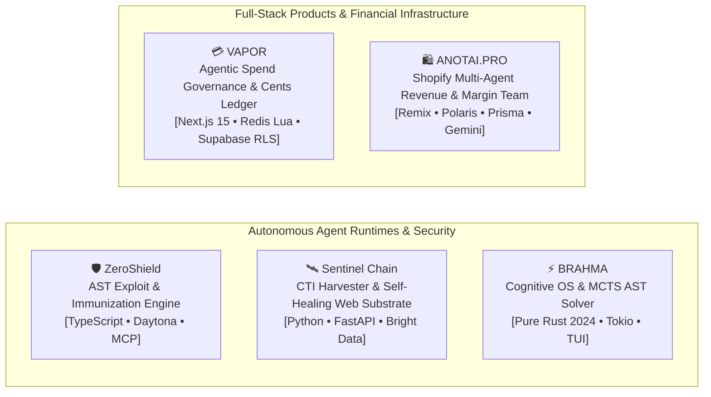

# Priyanshu
**AI-Assisted Software & Systems Engineer**  
*Building Autonomous Agent Runtimes, Full-Stack Applications, and Resilient Cloud Infrastructure.*

---

```
┌────────────────────────────────────────────────────────────────────────────────────────┐
│  "I leverage AI heavily to accelerate software development and ship products faster,   │
│   while maintaining full ownership of system architecture, engineering decisions,      │
│   deterministic invariants, testing, debugging, and deployment."                       │
└────────────────────────────────────────────────────────────────────────────────────────┘
```

---

## 🏛️ Selected Flagship Systems



---

### 1. [ZeroShield](https://github.com/priyanshupk2022-arch/zeroshield) — Autonomous Cyber Red-Team & Exploit Immunizer
*Autonomous vulnerability hunter, sandbox exploit arena, and AST codemod synthesizer built on Daytona SDK, TrueForge MCP, and Qodo.*

- **AST Vulnerability Hunter:** Traverses TypeScript/JavaScript Abstract Syntax Trees (`ts.createSourceFile`) to discover tainted source-to-sink injection paths (CWE-78 Command Injection, CWE-1321 Prototype Pollution, CWE-287 Broken Auth).
- **Daytona Ephemeral Sandboxes:** Provisions isolated containers to execute real attack payloads with zero false positives.
- **NVIDIA AVO Codemod Synthesizer:** Rewrites AST sinks into safe parameterized calls validated with `Zod` schemas.
- **Triple-Lock Verification:** Confirms payload is blocked, golden valid inputs pass (HTTP 200), and test suite passes (Exit 0).
- **Cryptographic HITL Gate:** HMAC SHA-256 review cards requiring cryptographic sign-off before dispatching GitHub PRs.
- **Verification:** **27/27 Passing Adversarial & Sandbox Tests** (`node --test packages/core/dist/**/*.test.js`).
- **Stack:** `TypeScript 5.7`, `Node.js 22`, `React 19`, `Daytona SDK`, `TrueForge MCP`, `Express 5.2`, `SQLite WAL`.

---

### 2. [SENTINEL-CHAIN](https://github.com/priyanshupk2022-arch/SENTINEL-CHAIN) — Autonomous CTI Harvester & Self-Healing Web Substrate
*Continuous Cyber Threat Intelligence ingestion platform that automatically repairs broken scrapers upon DOM redesigns.*

- **Mathematical Drift Model:** Computes structural drift $D_t = 1.0 - (0.50 C_f + 0.30 V_t + 0.20 A_c)$; isolates feeds when $D_t > 0.35$.
- **Bright Data AI Flow Self-Healing:** Dispatches DOM deltas to `/refactor_template`, polls progress, and deploys updated CSS selectors with zero downtime.
- **Threat Knowledge Graph:** Ingests validated CVE records and security advisories into relational graph entities in PostgreSQL/SQLite.
- **Verification:** **13/13 Passing Pytest E2E Tests** (`pytest backend/tests/ -v`).
- **Stack:** `Python 3.11`, `FastAPI`, `Next.js 14`, `SQLAlchemy 2.0 Async`, `Bright Data API`, `Pytest`.

---

### 3. [V4P0R](https://github.com/priyanshupk2022-arch/V4P0R) — Agentic Corporate Card & Spend Governance Engine
*Two-speed financial execution engine combining sub-100ms atomic Redis Lua authorizations with immutable PostgreSQL double-entry ledgers.*

- **Zero-Float Financial Math:** Strict `BigInt` integer minor units (`toCents`, `toDollars`, `addCents`) eliminating rounding bugs.
- **Atomic Lua Spend Locks:** Prevents concurrent agent double-spending via single-cycle Redis evaluation script (`process_authorization.lua`).
- **Immutable Ledger:** Append-only SQL schema with `DEBIT == CREDIT` balance checks and multi-tenant Row-Level Security (RLS).
- **HMAC Replay Protection:** Constant-time SHA-256 signature validation with 300-second timestamp drift windowing.
- **Verification:** **66/66 Passing Vitest Tests** across unit math, state machines, and Prava adapter integrations (`npm test`).
- **Stack:** `TypeScript`, `Next.js 15`, `Upstash Redis (Lua)`, `Supabase (PostgreSQL 15 RLS)`, `Vitest`.

---

### 4. [BRAHMA](https://github.com/priyanshupk2022-arch/BRAHMA) — Cognitive Operating System (CogOS) in Pure Rust
*Autonomous programming runtime with Monte Carlo Tree Search (MCTS) AST delta synthesis and cryptographic enclaves.*

- **Compiler-Coincident Synthesis (SQCS):** Salsa-like query database that tests incremental AST mutations and automatically rolls back type mismatches.
- **MCTS Type-Solver:** Simulates candidate code transformations and prunes type-invalid paths before compilation.
- **Zero-Trust Memory Enclave:** Memory scrubbers, Argon2 password hashing, AES-GCM encryption, and `#![forbid(unsafe_code)]`.
- **Interactive TUI:** Terminal interface built with `ratatui` and `crossterm`.
- **Stack:** `Rust 2024 Edition`, `Tokio`, `Syn`, `Quote`, `Rusqlite (WAL)`, `Ratatui`.

---

### 5. [ANOTAI.PRO](https://github.com/priyanshupk2022-arch/ANOTAI.PRO) — Shopify Multi-Agent Revenue & Margin Guardian Team
*Shopify-embedded Remix SaaS featuring a 5-agent autonomous operations team with hard COGS margin protections.*

- **Hierarchical Multi-Agent Team:** Personal Shopper, Cart Sniper, Margin Guardian, Retention Engine, and CEO escalation.
- **Margin Guardian Guardrail:** Hard financial logic that validates gross margins before approving discount generation.
- **Durable Action Queue:** Decouples AI recommendations from Shopify API execution with merchant approval thresholds.
- **Stack:** `TypeScript`, `Remix Vite`, `Shopify Polaris`, `Shopify App Bridge`, `Prisma ORM`, `Supabase`, `Google Gemini 1.5 Pro`.

---

## 🛠️ Technical Competencies & Tooling

| Domain | Technologies & Standards |
|---|---|
| **Languages** | TypeScript, JavaScript, Python 3.11+, Rust 2024, SQL, Bash / PowerShell |
| **Frameworks & Runtimes** | Node.js, Next.js (14/15 App Router), FastAPI, Remix, React 19, Tokio (Rust), Express |
| **Databases & Storage** | PostgreSQL (Supabase / Row-Level Security), Upstash Redis (Lua Scripting), SQLite (WAL Mode), Prisma |
| **AI & Autonomous Systems** | Model Context Protocol (MCP), Tool Use & Function Calling, NVIDIA AVO Loops, MCTS, Gemini SDK |
| **Testing & Quality** | Vitest, Pytest, Node Test Runner (`node --test`), Cargo Test, AST Codemods, Adversarial Red-Teaming |
| **Cloud & DevOps** | Docker / Docker Compose, Daytona SDK, Linux Containers, GitHub Actions CI/CD, HMAC Webhooks |

---

## 📐 Engineering Principles

1. **Deterministic Invariants Over Probabilistic Outputs:** AI accelerates drafting and iteration, but business logic, financial math, and security gates are enforced with deterministic code (Zod, BigInt cents, SQLite WAL, Redis Lua).
2. **Triple-Lock Verification:** Never claim a system is healed or passing without proving negative protection (exploit blocked), positive functionality (golden inputs HTTP 200), and non-regression (test suite exit 0).
3. **Fail-Closed Security:** Webhook replays, path traversals, missing cryptographic tokens, and type mismatches must reject immediately by default.
4. **Honest, Verifiable Evidence:** Every repository includes reproducible test commands and explicit architecture documentation.

---

<div align="center">
  <sub>Portfolio audited and verified against live source code • 2026</sub>
</div>

