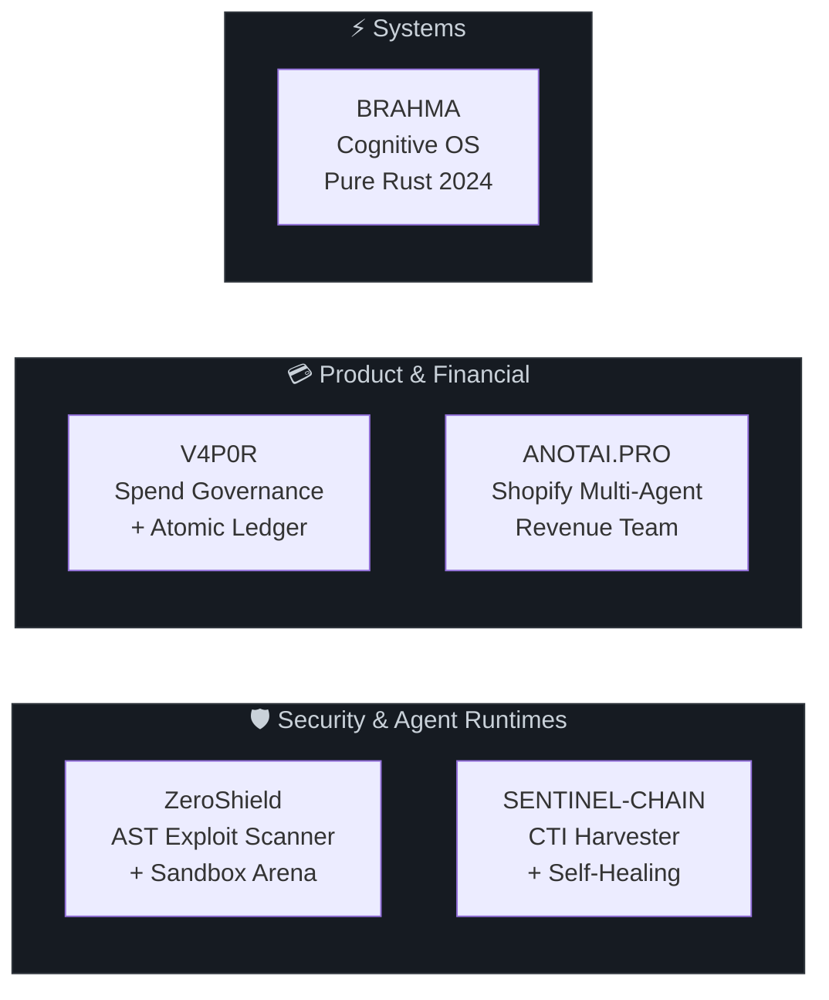

<!-- HEADER WAVE -->


<!-- TYPING SVG -->
<div align="center">

  <a href="https://github.com/priyanshupk2022-arch">
    
  </a>

  <br/><br/>

  <!-- SOCIAL BADGES -->
  <a href="https://www.linkedin.com/in/priyanshu-s4nvi/"></a>&nbsp;
  <a href="https://x.com/w3fparthh"></a>&nbsp;
  <a href="mailto:priyanshupk2022@gmail.com"></a>&nbsp;
  <a href="https://discord.com"></a>

</div>

<br/>

<!-- ABOUT ME -->


### &nbsp;`> whoami`

I build AI-powered products, autonomous agent systems, and production backend infrastructure. My work spans AST-level code analysis, self-healing data pipelines, deterministic financial engines, multi-agent SaaS platforms, and systems programming in Rust.

I take ideas from architecture through implementation, testing, and deployment — then iterate. I use AI tools in my workflow, but engineering decisions, system design, invariant enforcement, and testing are mine.

```
🔭  Current Focus    Autonomous agent runtimes & AST codemod synthesis
⚡  Core Domains     AI Systems • Full-Stack SaaS • Cloud Infrastructure • Security
🧪  Test Philosophy  Triple-Lock: exploit blocked + golden pass + suite exit 0
🦀  Systems Lang     Rust 2024 (#![forbid(unsafe_code)])
```

<br clear="both"/>

---

<!-- TECH STACK WITH SKILL ICONS -->
### &nbsp;`> tech --stack`

<div align="center">

#### Languages


#### Frameworks & Product


#### Data & Infrastructure


#### DevOps & Tools


</div>

---

<!-- GITHUB STATS -->
### &nbsp;`> stats --live`

<div align="center">
  
  
</div>

<br/>

<div align="center">
  
</div>

<br/>

<div align="center">
  
</div>

---

<!-- FLAGSHIP SYSTEMS -->
### &nbsp;`> projects --flagship`

<br/>

<div align="center">



</div>

<br/>

<!-- PROJECT 1: ZEROSHIELD -->
<table>
<tr>
<td>

#### 🛡️ [`ZeroShield`](https://github.com/priyanshupk2022-arch/zeroshield) — Autonomous Cyber Red-Team & Exploit Immunizer

> AST vulnerability scanner → ephemeral sandbox exploit arena → codemod synthesizer

- Scans JS/TS ASTs via TypeScript Compiler API (`ts.createSourceFile`) for CWE-78, CWE-1321, CWE-287 injection paths
- Provisions isolated Docker containers (Daytona SDK) to execute live attack payloads — zero false positives
- NVIDIA AVO synthesizes safe AST rewrites, validated by Zod schemas
- **Triple-Lock Gate:** exploit blocked + golden HTTP 200 + test suite exit 0
- TrueForge MCP Server (JSON-RPC 2.0) with SQLite WAL persistence
- HMAC SHA-256 human-in-the-loop sign-off before PR dispatch

     

</td>
</tr>
</table>

<!-- PROJECT 2: V4P0R -->
<table>
<tr>
<td>

#### 💳 [`V4P0R`](https://github.com/priyanshupk2022-arch/V4P0R) — Agentic Corporate Card & Spend Governance Engine

> Two-speed financial engine: sub-100ms Redis Lua authorization + immutable PostgreSQL double-entry ledger

- `BigInt` integer minor units (`centsMath.ts`) — zero IEEE 754 floating-point errors
- Atomic Redis Lua script (`process_authorization.lua`) — no race conditions, no double-spending
- Append-only SQL schema with `DEBIT == CREDIT` constraints + Row-Level Security
- Constant-time HMAC-SHA256 replay protection with 300s timestamp drift tolerance
- Clean architecture: `domain/` · `application/` · `infrastructure/` · `adapters/`

    

</td>
</tr>
</table>

<!-- PROJECT 3: SENTINEL-CHAIN -->
<table>
<tr>
<td>

#### 🛰️ [`SENTINEL-CHAIN`](https://github.com/priyanshupk2022-arch/SENTINEL-CHAIN) — Autonomous CTI Harvester & Self-Healing Web Substrate

> Continuous threat intelligence ingestion with closed-loop scraper self-healing

- Mathematical drift model: `Qs = 0.50·Cf + 0.30·Vt + 0.20·Ac` — quarantine when `Dt > 0.35`
- Bright Data AI Flow auto-repairs broken CSS selectors on DOM mutations
- Threat Knowledge Graph ingests CVE records into SQLAlchemy async entities
- In-process mock target server for fully offline E2E testing

    

</td>
</tr>
</table>

<!-- PROJECT 4: BRAHMA -->
<table>
<tr>
<td>

#### ⚡ [`BRAHMA`](https://github.com/priyanshupk2022-arch/BRAHMA) — Cognitive Operating System (CogOS) in Pure Rust

> MCTS AST delta synthesis + cryptographic memory enclaves + interactive TUI

- Monte Carlo Tree Search type-solver prunes invalid AST branches before compilation
- Salsa-like incremental query DB auto-rolls back type mismatches
- `#![forbid(unsafe_code)]` · Argon2 hashing · AES-GCM encryption · `zeroize` memory scrubbing
- 30+ modules: `mcts.rs` · `mutator.rs` · `parser.rs` · `crypto.rs` · `sandbox.rs` · `orchestration.rs`

    

</td>
</tr>
</table>

<!-- PROJECT 5: ANOTAI.PRO -->
<table>
<tr>
<td>

#### 🛍️ [`ANOTAI.PRO`](https://github.com/priyanshupk2022-arch/ANOTAI.PRO) — Shopify Multi-Agent Revenue & Margin Guardian

> 5-agent autonomous operations team embedded in Shopify Admin with hard COGS margin protections

- Agent squad: Personal Shopper · Cart Sniper · Retention Engine · Margin Guardian · CEO Escalation
- Margin Guardian computes COGS in real time, vetoes unprofitable discounts automatically
- Durable action queue with configurable merchant risk tolerances
- Token consumption + API cost tracking per workflow execution

    

</td>
</tr>
</table>

---

<!-- TOP LANGUAGES -->
<div align="center">
  
</div>

---

<!-- ENGINEERING PRINCIPLES -->
### &nbsp;`> principles`

```
┌─────────────────────────────────────────────────────────────────────────────┐
│  DETERMINISTIC INVARIANTS > PROBABILISTIC OUTPUTS                          │
│  Business logic, financial math, and security gates enforced by            │
│  deterministic code: Zod schemas, BigInt cents, Redis Lua, DB constraints  │
├─────────────────────────────────────────────────────────────────────────────┤
│  TRIPLE-LOCK VERIFICATION                                                  │
│  1. Exploit payload blocked  2. Golden inputs pass  3. Test suite exit 0   │
├─────────────────────────────────────────────────────────────────────────────┤
│  FAIL-CLOSED SECURITY                                                      │
│  Missing auth, invalid signatures, type mismatches → reject immediately    │
├─────────────────────────────────────────────────────────────────────────────┤
│  CODE IS THE SOURCE OF TRUTH                                               │
│  Every claim verified against live source code and reproducible test runs   │
└─────────────────────────────────────────────────────────────────────────────┘
```

---

<div align="center">
  
</div>

<br/>

<!-- FOOTER WAVE -->

